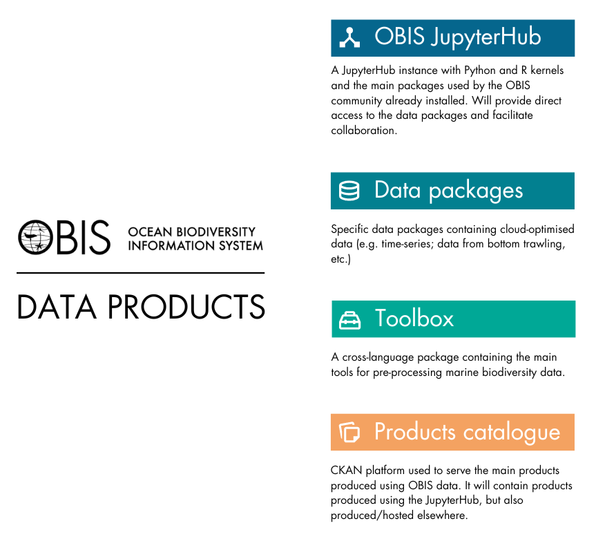

# OBIS JupyterHub

Repository for the administration of the OBIS JupyterHub and associated products

## OBIS data products

<table>
    <tbody>
        <tr>
            <td rowspan=4></td>
            <td>Repository: <a href="https://github.com/iobis/obis-hub">iobis/obis-hub</a>  Website: https://jupyter.obis.org/</td>
        </tr>
        <tr>
            <td>Repository: <a href="https://github.com/iobis/obis-hub">iobis/obis-hub</a></td>
        </tr>
        <tr>
             <td>Repository: <a href="https://github.com/iobis/obistoolbox">iobis/obistoolbox</a></td>
        </tr>
        <tr>
             <td>Repository: <a href="https://github.com/iobis/obis-catalogue">iobis/obis-catalogue</a>  Website: https://ckan.obis.org/</td>
        </tr>
    </tbody>
</table>
